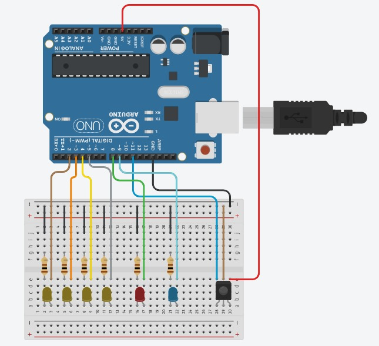
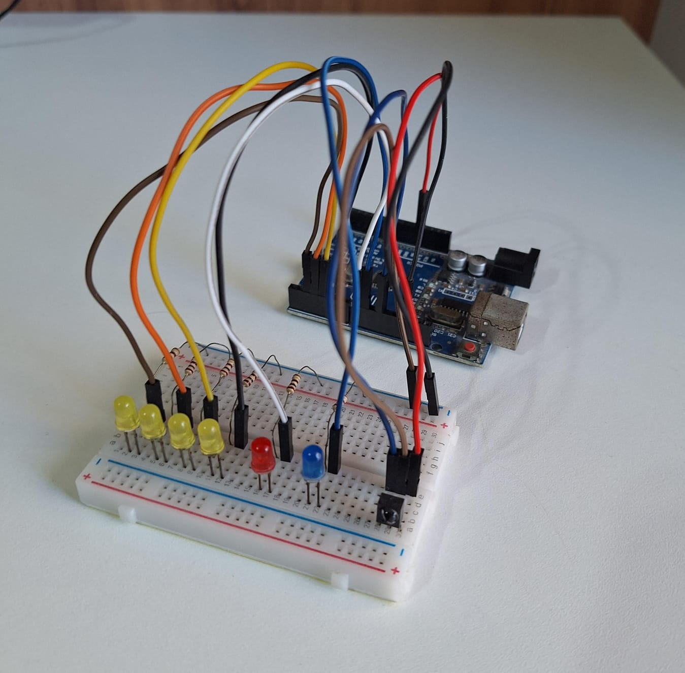

# Sistema de Senha

O projeto permite a validação de uma senha utilizando um controle remoto infravermelho. A senha é composta por uma sequência de quatro números (0-9) e o sistema verifica se a sequência digitada corresponde à senha correta. Se a senha estiver correta, o sistema mostra uma animação de sucesso. Caso contrário, uma animação de erro que simula uma explosão acontece.
É possível também definir uma senha personalizada se a última tentativa for correta.

## Componentes

1. **Arduino Uno**: Placa principal que controla o sistema.
2. **Protoboard**: Para facilitar as conexões dos componentes.
3. **Controle Remoto Infravermelho**: Utilizado para enviar os números da senha.
4. **Módulo Receptor Infravermelho**: Recebe os sinais do controle remoto.
5. **LEDs (6x)**: Indicadores de sucesso e erro.
6. **Resistores de 100 ohms (6x)**: Para limitar a corrente dos LEDs.

## Grupo

- **Nome** -  No USP
- **Nome** -  No USP
- **Nome** -  No USP
- **Nome** -  No USP
- **Nome** -  No USP

## Imagens

    
    
 Circuito simulado no TinkerCad 

&nbsp; &nbsp; &nbsp;

    
    
 Circuito montado 

## Vídeo de Demonstração
